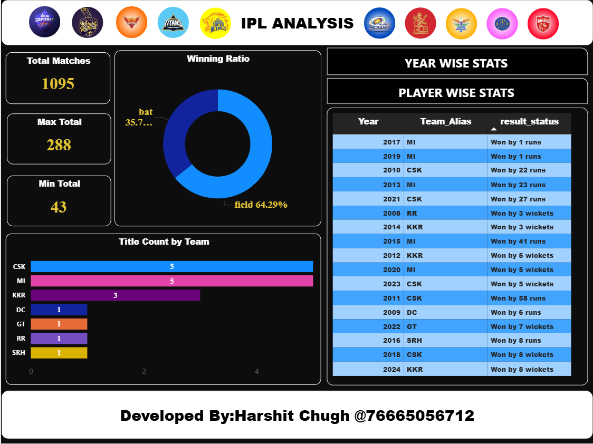
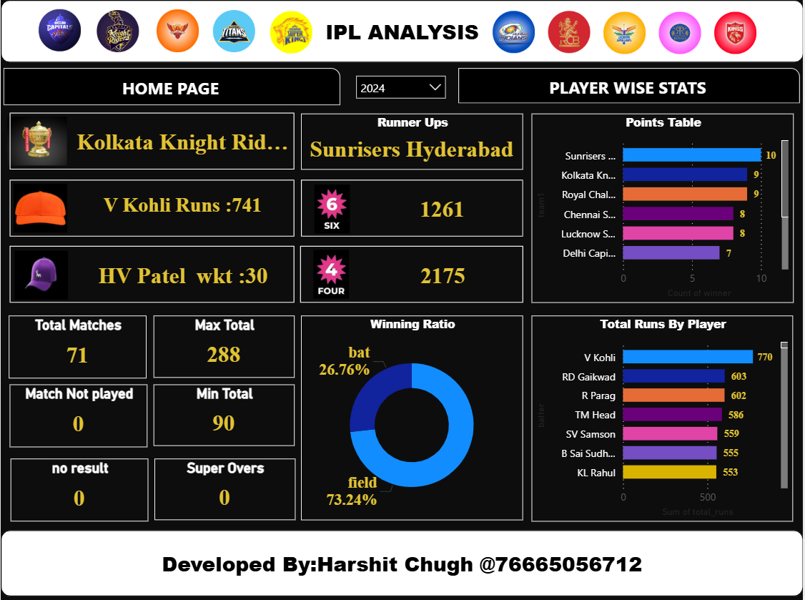
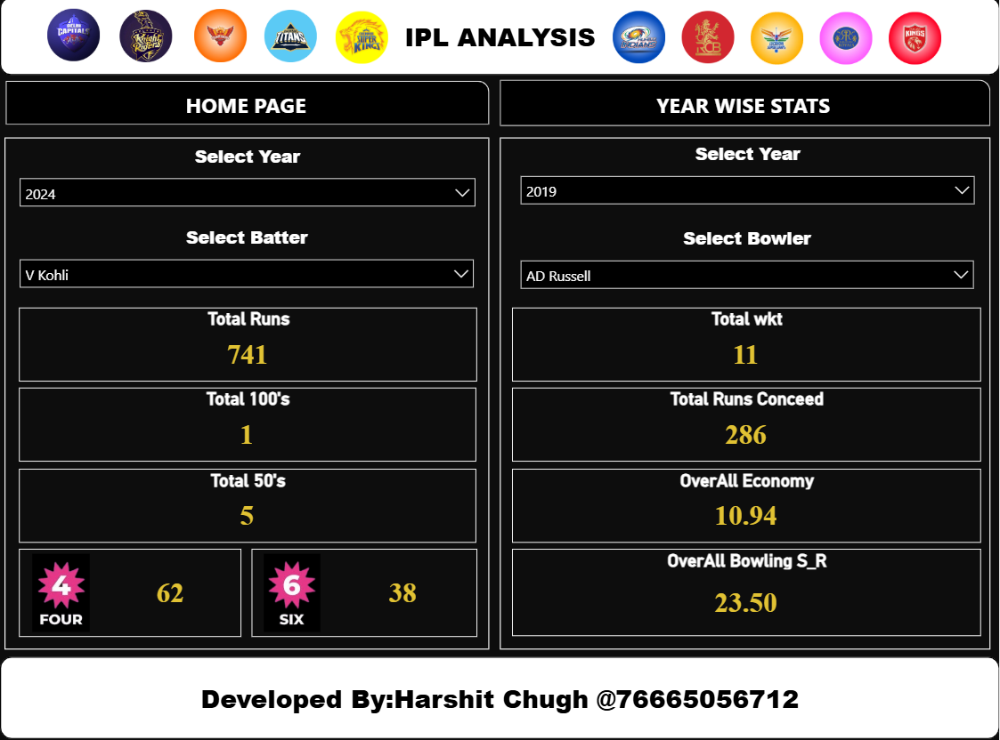

  <a href="https://your-live-dashboard-link.com">
      
      
      
  </a>

# 🏏 IPL Data Analysis Dashboard

This Power BI project provides a comprehensive analysis of IPL (Indian Premier League) matches and player performance. The dashboard offers insights into match outcomes, top performers, venue-based stats, and team comparisons using interactive visuals and filters.

📊 Project Overview
Project Title: IPL Data Analysis Dashboard

Tool Used: Microsoft Power BI

Dataset: IPL matches and player statistics (custom dataset, cleaned and transformed)

Objective: To provide dynamic insights into IPL team and player performance using interactive visualizations.

🧠 Key Insights
Top Run Scorers & Wicket Takers by season

Win percentage of each team

Toss impact on match result

Venue-wise performance trends

Head-to-head comparison between teams

Season-wise team dominance

Player of the Match analysis

📌 Features
Interactive Slicers (Team, Venue, Season, Player)

Clean and minimal UI for readability

Drill-down and tooltip-enabled charts

Dynamic filters for faster insights

